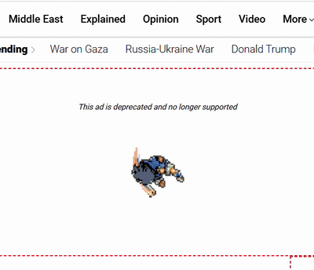

<h1 align="center">Welcome to MockAdBlock 👋</h1>
<p align="center">
  
</p>

> **MockAdBlock** is your snarky sidekick in the battle against ads! It doesn't just block ads; it replaces them with witty messages, jokes, and entertaining GIFs. Enjoy a more amusing browsing experience as this passive-aggressive ad blocker works its magic on most websites (though some with messy HTML might slip through). Get ready to be entertained while you surf!




## 🚀 Installation Guide

#### Step 1: Clone the Repository

```sh
git clone https://github.com/SwayamMehta10/MockAdBlock.git
```

#### Step 2: Open Chrome Extensions Page

Fire up Chrome and head over to `chrome://extensions/`.

#### Step 3: Enable Developer Mode

Flip the **Developer mode** switch in the top right corner.

#### Step 4: Load Unpacked Extension

Hit the **Load unpacked** button and choose the `MockAdBlock` directory you just cloned.

#### Step 5: Enjoy the Snark!

Boom! MockAdBlock is now live. Surf the web and bask in the passive-aggressive glory. 🎉

## 🎭 Snark Modes

MockAdBlock offers a variety of snark modes to keep you entertained:

- **Classic Snark**: The original and timeless snarky comments.
- **Dad Joke**: Corny and funny dad jokes to lighten your mood.
- **Existential Crisis**: Deep and thought-provoking messages that make you question everything.
- **Tech Humor**: Jokes and comments that only tech enthusiasts will understand.
- **Motivational (but not really)**: Sarcastic and humorous motivational quotes.

Click on the extension to choose your favorite mode and enjoy a personalized snarky browsing experience!


<br>
❗❗❗P.S. The actual content of websites may sometimes get replaced, so just change the site access setting from "On all sites" to "When you click the extension".

## 🌟 Show Your Support

If you enjoyed using MockAdBlock, please consider giving it a ⭐️ on GitHub! Your support helps keep the snark alive and motivates me to improve the extension.

Spread the word and let others join the fun! 🚀

## 👤 About the Author

**Swayam Mehta** is a passionate developer who loves creating fun and useful tools. Check out more of his work on his [portfolio](https://swayam-mehta-portfolio.vercel.app/) and connect with him on:

[](https://github.com/SwayamMehta10)
[](https://linkedin.com/in/swayammehta10)
[](https://twitter.com/haveYouMetSam_)
[](https://threads.net/@swayam_mehta_)
