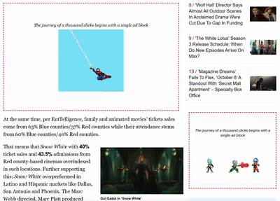

<h1 align="center">Welcome to MockAdBlock</h1>
<p align="center">
  
</p>

> **MockAdBlock** is your snarky sidekick in the battle against ads! It doesn't just block ads; it replaces them with witty messages, jokes, and entertaining GIFs. Enjoy a more amusing browsing experience as this passive-aggressive ad blocker works its magic on most websites (though some with messy HTML might slip through). Get ready to be entertained while you surf!




## Installation Guide

### Manual Installation

1. Clone the repository:
    ```sh
    git clone https://github.com/SwayamMehta10/MockAdBlock.git
    ```
2. Open Chrome and navigate to `chrome://extensions/`
3. Enable **Developer mode** in the top right corner
4. Click **Load unpacked** and select the `MockAdBlock` directory
5. Start browsing with attitude!

## Snark Modes

MockAdBlock offers a variety of snark modes to keep you entertained:

-   **Classic Snark**: The original and timeless snarky comments.
-   **Dad Joke**: Corny and funny dad jokes to lighten your mood.
-   **Existential Crisis**: Deep and thought-provoking messages that make you question everything.
-   **Tech Humor**: Jokes and comments that only tech enthusiasts will understand.
-   **Motivational (but not really)**: Sarcastic and humorous motivational quotes.

## How to Use

1. Click the **MockAdBlock** icon in your Chrome toolbar
2. Choose your preferred snark mode from the dropdown menu
3. Browse any website and watch ads get replaced with entertaining content
4. Change modes anytime to keep things fresh!


### Important Note

MockAdBlock works on most websites but excludes major platforms like YouTube, Netflix, Amazon, and social media sites to ensure they function properly. If you notice any issues with website content being replaced, you can adjust the extension's site access settings in Chrome.

## Features

-   **Multiple Snark Modes**: Switch between different humor styles on the fly
-   **Visual Entertainment**: Ads are replaced with entertaining GIFs and messages
-   **Smart Filtering**: Excludes major platforms to prevent interference
-   **Lightweight**: Minimal performance impact on your browsing
-   **Easy Toggle**: Simple popup interface to change settings instantly

## Show Your Support

If you enjoyed using MockAdBlock, please consider:

-   ⭐ Giving it a star on [GitHub](https://github.com/SwayamMehta10/MockAdBlock)
-   📢 Sharing it with friends who need more snark in their lives

Your support helps keep the extension alive and motivates continued improvements!
